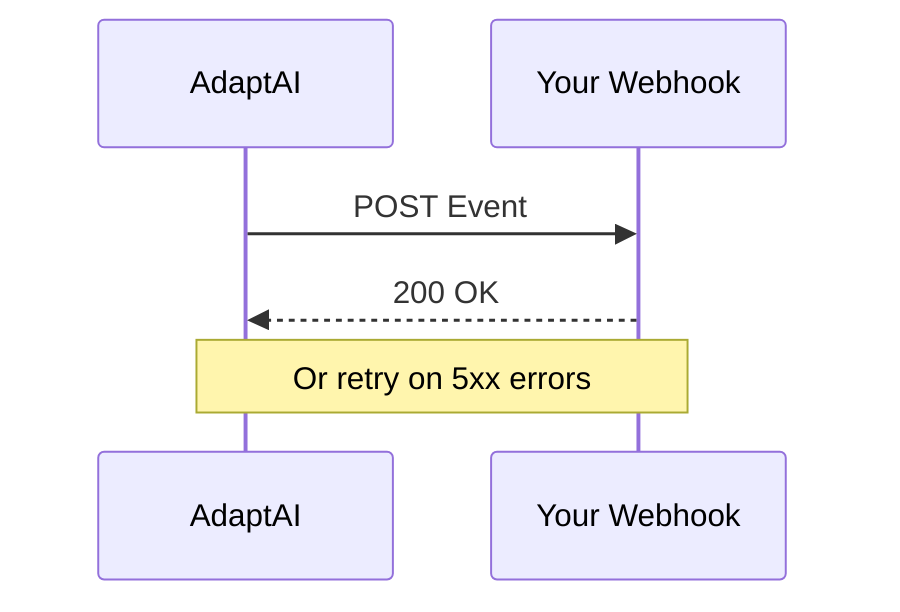

## Overview

AdaptAI integrates seamlessly with popular HR and communication tools to automate employee support. You can connect services like BambooHR for employee data, Slack for notifications, and Microsoft Teams for collaboration. These integrations enable real-time data sync, automated responses, and analytics across your stack.

For custom workflows, configure webhooks to push events from AdaptAI to your systems. Follow the steps below to set up connections securely.

<Columns cols={3}>
  <Card title="HR Tools" icon="users" href="#hr-integrations">
    Sync employee records and queries.
  </Card>
  <Card title="Communication" icon="message-circle" href="#communication">
    Send alerts and responses instantly.
  </Card>
  <Card title="Webhooks" icon="zap" href="#webhooks">
    Custom real-time data flows.
  </Card>
</Columns>

## HR Integrations

Connect AdaptAI to HR platforms for automatic employee data import and query resolution.

<Tabs>
  <Tab title="BambooHR" icon="database">
    <Steps>
      <Step title="Generate API Key" icon="key">
        Log in to BambooHR, navigate to **Account > Apps > Make a New Connection**, and generate an API key with read access to employee data.
      </Step>
      <Step title="Configure in AdaptAI" icon="settings">
        In your AdaptAI dashboard, go to **Integrations > HR**, select BambooHR, and enter your subdomain and API key.
      </Step>
      <Step title="Test Connection" icon="check-circle">
        Run a test sync to verify employee data pulls correctly.
      </Step>
    </Steps>

    <CodeGroup tabs="Configuration">
      ```json
      {
        "subdomain": "yourcompany",
        "apiKey": "YOUR_BAMBOOHR_API_KEY"
      }
      ```
    </CodeGroup>
  </Tab>
  <Tab title="Workday" icon="database">
    Use OAuth 2.0 for secure access. Generate client credentials in Workday and add them to AdaptAI's integration panel.
  </Tab>
</Tabs>

## Communication Integrations

Route AdaptAI responses to your team's chat tools.

<Callout kind="tip">
  Enable notifications to keep your support team informed of high-priority queries.
</Callout>

<Tabs>
  <Tab title="Slack" icon="message-circle">
    <Steps>
      <Step title="Create App" icon="plus">
        Visit `https://api.slack.com/apps`, create a new app, and enable Incoming Webhooks.
      </Step>
      <Step title="Add Webhook URL" icon="link">
        Copy the webhook URL and paste it into AdaptAI under **Integrations > Slack**.
      </Step>
    </Steps>

    ```javascript
    // Example Slack payload from AdaptAI
    {
      "text": "New employee query resolved: Benefits question",
      "channel": "#support"
    }
    ```
  </Tab>
  <Tab title="Microsoft Teams" icon="monitor">
    Use the Teams Incoming Webhook connector. Configure the URL in AdaptAI for card-based notifications.
  </Tab>
</Tabs>

## Configuring Webhooks

Set up webhooks in AdaptAI to send real-time events to your endpoint.

<Steps>
  <Step title="Create Webhook" icon="plus">
    In the dashboard, go to **Integrations > Webhooks > New Webhook**. Enter your endpoint URL, e.g., `https://your-webhook-url.com/webhook`.
  </Step>
  <Step title="Select Events" icon="zap">
    Choose events like `query.resolved` or `employee.onboarded`.
  </Step>
  <Step title="Verify Signature" icon="shield">
    Use HMAC SHA-256 with your secret to validate payloads.
  </Step>
</Steps>

<ParamField header="X-Webhook-Signature" param-type="string" required="true">
  HMAC signature for payload verification.
</ParamField>

<ParamField body="event" param-type="string" required="true">
  Event type, e.g., `query.resolved`.
</ParamField>

<ResponseField name="data" field-type="object">
  Event-specific payload with employee details.
</ResponseField>

<CodeGroup tabs="Node.js,Python">
  ```javascript
  const crypto = require('crypto');
  const signature = 'sha256=' + crypto.createHmac('sha256', 'YOUR_WEBHOOK_SECRET')
    .update(payload)
    .digest('hex');
  ```
  ```python
  import hmac
  import hashlib
  signature = 'sha256=' + hmac.new(
    b'YOUR_WEBHOOK_SECRET', payload, hashlib.sha256
  ).hexdigest()
  ```
</CodeGroup>

## Best Practices for Secure Connections

- Rotate API keys and webhook secrets every 90 days.
- Use least-privilege access: Grant only read permissions for HR syncs.
- Validate all incoming payloads with signatures to prevent replay attacks.
- Monitor webhook delivery rates in AdaptAI analytics.

<Callout kind="alert">
  Never expose secrets in client-side code or public repositories. Use environment variables like `{process.env.API_KEY}`.
</Callout>

<Expandable title="Advanced Webhook Retry Logic" default-open="false">
  AdaptAI retries failed webhooks up to 5 times with exponential backoff. Customize via headers:

  | Header          | Description                  |
  |-----------------|------------------------------|
  | `Retry-After`  | Seconds before next attempt |
  | `X-Retry-Count`| Current retry number        |
</Expandable>

